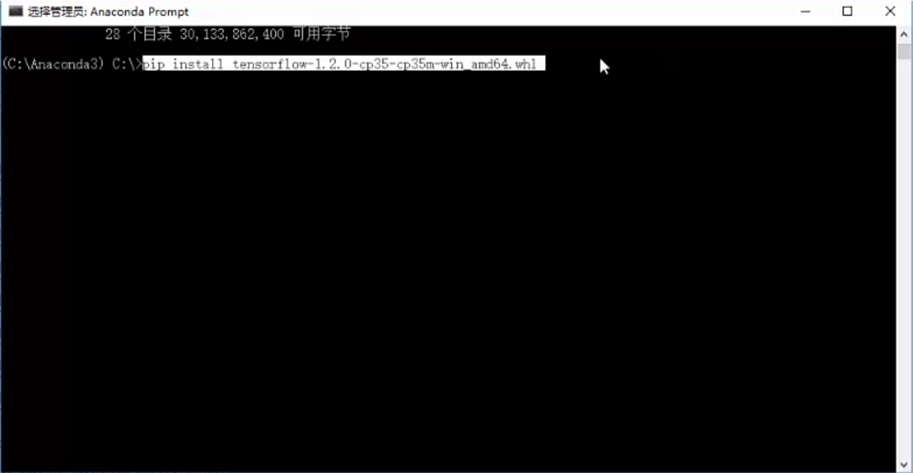

# packages

### 查看安装的所有库

在anaconda prompt中运行

```text
pip list
//或者运行 conda list
```

### Find packages



### Python库下载地址

当用pip install无法安装时，可在下面的网址上去找想要安装的库



例如，当在prompt中pip install worldcloud出错时，到该页面下载所需的wordcloud模块的whl文件，下载后进入存储该文件的路径，在prompt中执行“pip install wordcloud-1.4.1-cp35-cp35m-win\_amd64.whl”，这样就能安装成功。



### 更新包

在Anaconda prompt中输入

```text
pip install --upgrade xxxx
//或者pip install -U xxx
```


### 删除包

在Anaconda prompt中输入

```text
pip uninstall xxxx
```

### 查看包的相关信息

在Anaconda prompt中输入

```text
pip show xxx
```


